# Portal User Flows & UI/UX Design Specifications

This document outlines the user flows, security controls, and UI/UX design specifications for the external portals (Suppliers and Customs Brokers) in the **Import & Customs Operations** (`midvex_customs_op`) module. 

---

## 1. Persona Profiles

### A. The External Supplier (Vendor / Manufacturer)
* **Goal**: Provide the requested commercial and regulatory documents (e.g., Commercial Invoice, Packing List, Health Certificate, COA) to ensure the shipment is not delayed at the destination port.
* **Tech Comfort**: Medium-Low. They want a simple, checklist-driven page where they can upload files and see if they are approved or rejected.
* **Access Boundary**: Can only view operations where their partner is linked in `supplier_ids`.

### B. The Customs Broker (Gümrük Müşaviri)
* **Goal**: Download the fully approved document package to submit to the customs office (Gümrük Müdürlüğü) and log the official Customs Declaration (Beyanname) once cleared.
* **Tech Comfort**: Medium-High. They want speed and organization. They need a single-click ZIP download of all verified docs.
* **Access Boundary**: Can only view operations where their partner is linked as `broker_id`.

---

## 2. Portal User Flows & Interaction Model

```mermaid
graph TD
    subgraph Supplier Flow
        S1[Log into Portal] --> S2[View Pending Shipments]
        S2 --> S3[Open Document Checklist]
        S3 -->|Upload PDF| S4[Submit for Review]
        S4 -->|If Rejected| S5[Read Rejection Reason & Re-upload]
    end

    subgraph Broker Flow
        B1[Log into Portal] --> B2[View Assigned Customs Cases]
        B2 --> B3[Download Approved Doc ZIP]
        B3 --> B4[Submit Customs Declaration PDF]
        B4 --> B5[Update Declaration Number & Status]
    end
```

---

## 3. Improved UI/UX Layout Specifications

To offer a premium, intuitive experience, the portal page is organized into four main sections:

### A. The Visual Shipment Tracker (ETA & Status Timeline)
* **Visual Representation**: A clean, horizontal timeline tracker mapping the workflow stages:
  $$\text{Production} \rightarrow \text{Waiting for Docs} \rightarrow \text{In Transit} \rightarrow \text{Customs Clearance} \rightarrow \text{Delivered}$$
* **UX Benefit**: Gives the external partner immediate context of the shipment's physical progress.

### B. Consolidated Document Management & Overview
Instead of a raw table, documents are presented as **Status Cards** grouped by action requirements:
1. **Action Required (Rejected / Correction Needed)**: Highlighted in **light red** with a prominent alert box displaying the internal reviewer's `rejection_reason`. Includes a direct upload button.
2. **Pending Upload / Requested**: Highlighted in **light blue**. Simple file input to upload the requested scan.
3. **Approved**: Highlighted in **green** with a checkmark icon. Displays file names as clickable links for downloading.
4. **Internal / N/A**: Hidden from the external user to avoid interface clutter.

### C. The Version History Accordion
* **UX Pattern**: Under each document requirement, an optional collapsible history list shows:
  * *Version 1*: Original upload (Date) - *Rejected (Comment: Missing signature)*.
  * *Version 2*: Updated upload (Date) - *Approved*.
* **UX Benefit**: Eliminates back-and-forth emails explaining why a document was rejected, keeping the entire audit trail in Odoo.

### D. The One-Click Broker Toolkit
A dedicated sidebar card visible **only to the Broker**:
* **Download Approved Package**: Generates a ZIP file containing only the documents in approved/accepted states.
* **Declaration Form**: Fields for `customs_declaration_number` (validated 16-character string), `customs_declaration_date`, and `customs_status` select dropdown.

---

## 4. Guidelines for Future Development Agents
When modifying `controllers/portal.py` or the portal XML templates:
1. **Never Bypass Security**: Ensure `_check_operation_access()` is run on all controller endpoints.
2. **Dynamic UI Rendering**: Always guard form elements using `t-if="is_supplier"` or `t-if="is_broker"` to ensure roles do not see irrelevant fields or buttons.
3. **Safe HTML escaping**: When displaying rejection reasons or comments, ensure values are rendered safely using standard Odoo output mechanisms.
